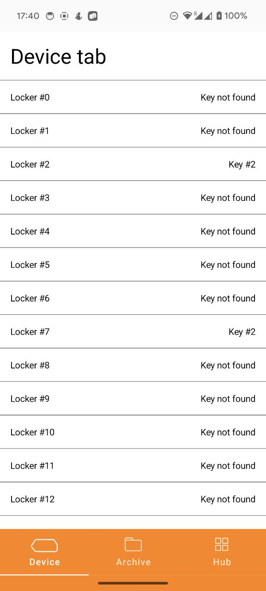
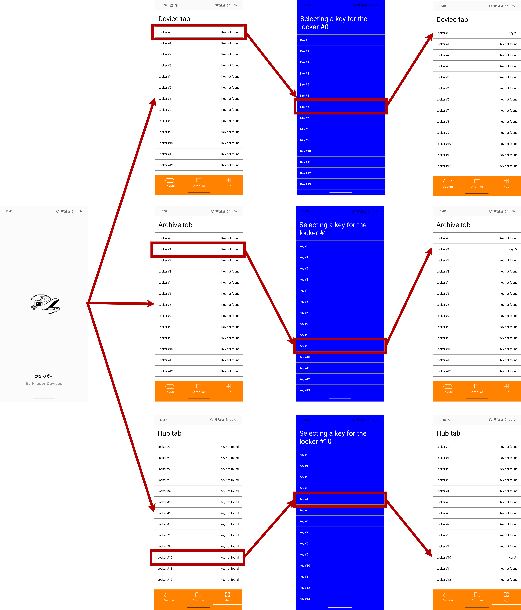

# Test task in Flipper Devices on Android developer

This assignment is designed to be as close to a real-world task as possible, even though it's not simple. The exact same architecture and screens are in the main application and you will be able to use it as a reference to solve the test case

## Introduction

In the repository is an application with three tabs. In each tab is a list of locks ("Locker") with unbound keys

## Task

You need to make a full screen "locker" selection for each key. Keep in mind that:
- The colour of the status bar/navigation bar should be different and change correctly between screens
- Tabs have a "life of their own", when switching the status is saved, a key added for a locker in one tab does not go to another tab
- The screen must be in a Decompose-graph, without using additional Activity or Fragment
- The application must be able to recover from the background
- The separate key screen should be in a separate module, designed in the same way as lockerchoose/bottombar with an explicit api module and implications

Here is a schematic of a ready working application:

The important thing is that there are essentially two screens - one is the key selection screen, the other is the bottom bar screen, there are many screens in the diagram to give an example of how this might work.  The background colour on the fullscreen is specifically made in a different colour to emphasise the work of changing the colour of the status bar - you should do the same.

Alternatively, you can install the ready app solution on your phone [from here](docs/app-internal.apk) and check it. There might be bugs and it's not a perfect solution :)

# Useful materials

- Decompose documentation: https://arkivanov.github.io/Decompose/
- Main project repository: https://github.com/flipperdevices/Flipper-Android-App
- Anvil documentation: https://github.com/square/anvil
- Dagger Assisted Injection: https://dagger.dev/dev-guide/assisted-injection.html
- Dagger course from Android Broadcast on YouTube: https://www.youtube.com/playlist?list=PL0SwNXKJbuNkYFUda5rlA-odAVyWItRCP
